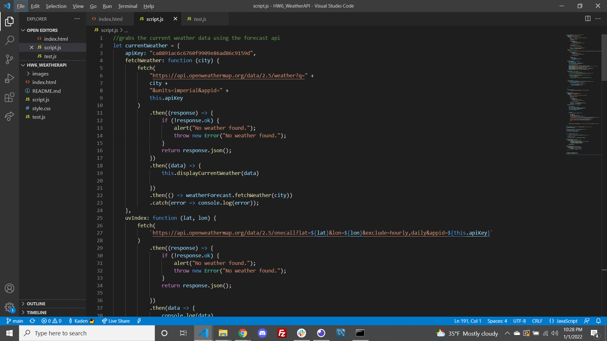
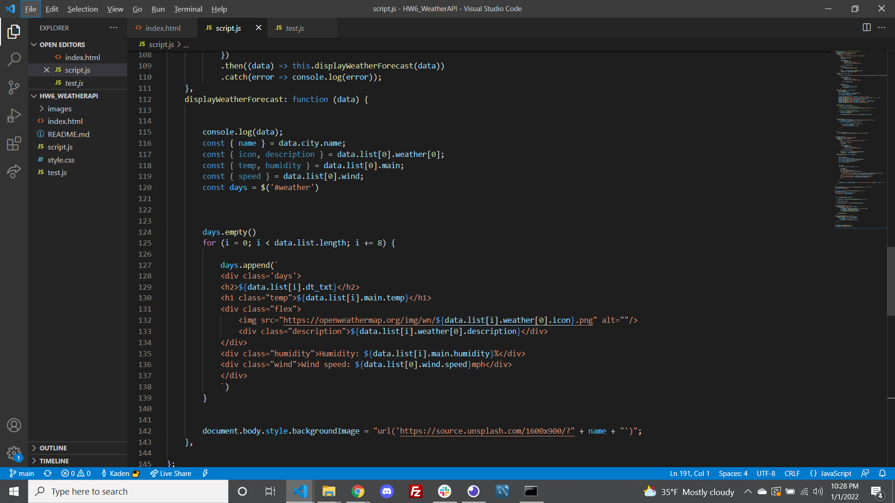
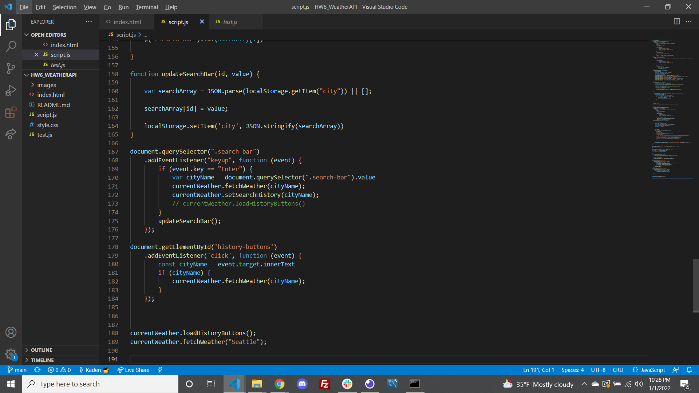

# HW6_WeatherAPI
(https://opensource.org/licenses/MIT)
## INSTRUCTIONS
This project is for understanding how to make web API calls. 

##Table of Contents
*[Installation:] (#installation)
*[Usage:] (#usage)
*[License:](license)
*[Contribution:] (#contributing)
*[Testing:] (#tests)
*[Questions?](#questions)

##Installation
There are no installation instructions for this application

##Usage
You can use this program to follow the weekly weather forecast for the city of your desired choice. You can view live up-to-date weather conditions in just about any city that interests you.

##Example
Here you can see some key elements within the code that uses the web API to extract data:

 # License
            This project is license under the MIT license
            

##Contributing
Users can contribute to this project by adding aesthetic features, making the interface smoother and perhaps more advanced save search implementations.

##Tests
This project can be tested by visiting my GitHub repositories, clone the HW6_WeatherAPI repository, and deploying the html page to a desired web browser

##Questions

    If you have any questions regarding the repository published, please feel free to reach out to me at kadenkelsey33@gmail.com,
    if you would like to look at the code that made this application, you can find this under my repos in GitHub. My GitHub
    username is K-Kelsey
    
